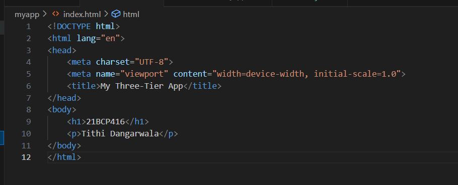
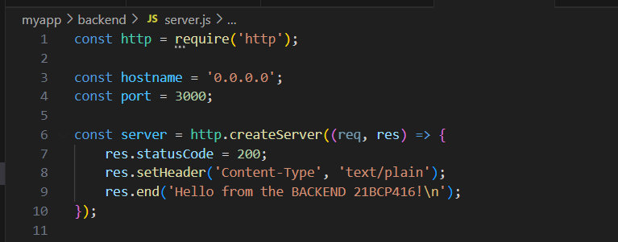
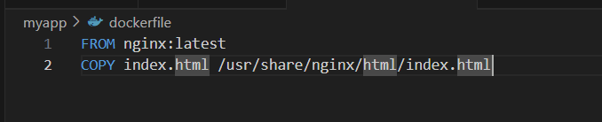
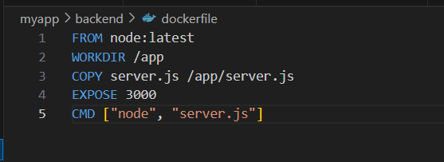
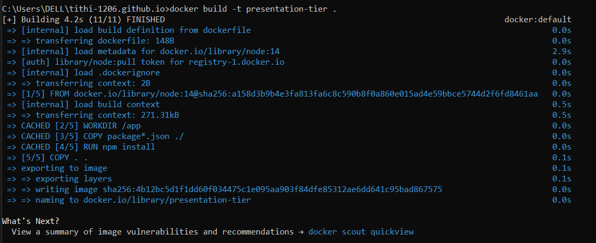
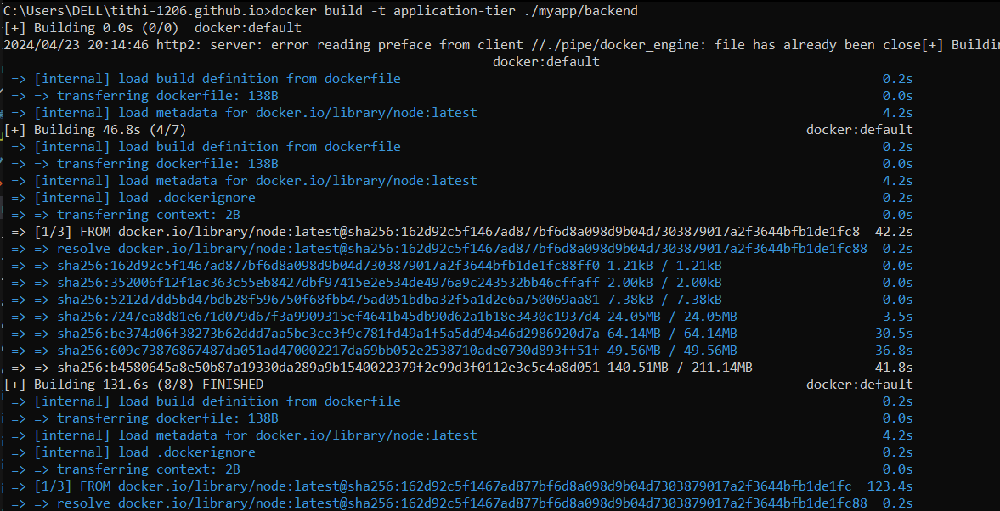
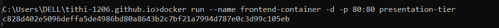
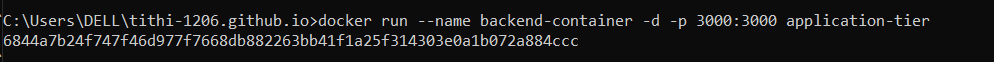

---

layout: home
title: Building a Three-Tier Application with Docker
---
Prerequisites
Before you begin, make sure you have the following prerequisites:

Docker installed on your local machine
A Dockerhub account (you can sign up for free at Dockerhub)

# Building a Three-Tier Application with Docker

In this tutorial, we'll walk through the process of building a three-tier application using Docker. A three-tier architecture consists of three distinct layers: presentation tier (frontend), application tier (backend), and data tier (database). We'll containerize each tier separately and set up a multi-container environment.

## Step 1: Setting Up the Presentation Tier (Frontend)

We'll start by creating the presentation tier, which will be a basic HTML/CSS page displaying some information.

mkdir my-app
cd my-app
Create index.html:

Step 2: Building the Application Tier (Backend)
Next, we'll create the application tier, which will be a Node.js server serving some data.

mkdir backend
cd backend
Create server.js:

Step 3: Configuring the Data Tier (Database)
For the data tier, we'll use the official MySQL Docker image for the database. However, for brevity, we'll skip the setup in this tutorial.

Step 4: Dockerizing Each Tier
Now, we'll containerize each tier using Docker.

Frontend Dockerfile
Dockerfile
# Dockerfile for presentation tier

# Dockerfile for application tier

Step 5: Building Docker Images
Build Docker images for each tier:
docker build -t presentation-tier .
docker build -t application-tier ./backend

Step 6: Running Docker Containers
Run containers for frontend and backend:
docker run --name frontend-container -d -p 80:80 presentation-tier
docker run --name backend-container -d -p 3000:3000 application-tier

Step 7: Accessing the Application
Access the frontend at http://localhost and the backend at http://localhost:3000.

Congratulations! You've successfully created a three-tier application using Docker.
